# 第1章&nbsp;&nbsp;部署虚拟环境安装linux系统
--------
**章节简述：**

&nbsp;&nbsp;&nbsp;&nbsp;&nbsp;&nbsp;&nbsp;本章节带领读者从0基础了解虚拟机与红帽系统，完整的演示了在VM与KVM中安装红帽RHEL7系统的方法。
特别增加了超级实用的****Linux系统找回root密码、虚拟机功能增强包、VNC远程控制服务****等相关的技术知识点。
简单了解守护进程即可，对了！在安装RPM软件包或配置YUM软件仓库时请格外注意参数细节哦~

####1.1 准备您的工具
&nbsp;&nbsp;&nbsp;&nbsp;&nbsp;&nbsp;&nbsp;所谓工欲善其事必先利其器，在本书第一章需要读者们搭建出为课后练习实验所使用的红帽RHEL7系统环境，读者不需要为了课程实验而单独购买一台新电脑，下面的小节中会教给您如何通过“虚拟机”来模拟出“仿真系统”，虚拟机是能够让用户在一台真机上模拟出多台操作系统的软件，一般来讲当前主流的硬件配置都是没问题的。

**强烈建议读者采用与本书一致的虚拟机软件与RHEL7镜像系统，否则可能会导致实验失败!!**

软件资源请在这里下载:
http://www.linuxprobe.com/tools/

**VmwareWorkStation  11.0——虚拟机软件（必需）：**
* 功能强大的桌面虚拟计算机软件，能够让用户在单一主机同时运行多个不同的操作系统。
* 同时支持实时快照，虚拟网络，拖拽文件以及PXE等强悍功能。

**RedHatEnterpriseLinux [RHEL]7.0——红帽操作系统（必需）：**

&nbsp;&nbsp;&nbsp;&nbsp;&nbsp;&nbsp;&nbsp;由开源软件及全球服务性系统开发商红帽公司出品，最稳定出色的Linux操作系统。

&nbsp;&nbsp;&nbsp;&nbsp;&nbsp;&nbsp;&nbsp;说来真的很郁闷、其实我在高中时就有学习Linux系统的冲动，那时上网还不便捷，所以安装系统都需要去买光盘，而那时的linux系统至少需要6张光盘（CD-Rom容量为700M），尝试安装了几次却一直报错，搞不懂只能放弃了，今年春节收拾屋子翻出了这些光盘，再次安装时找到了错误的原因，原来是第五张光盘被“刮花”了，导致依赖的软件包无法安装，真的是很无语、很郁闷，原本可以早几年就开始学Linux系统了，所以这里提示读者：**“准备齐工具后一定要校验完整性”。**

**Hash1.0.4——文件校验工具（推荐）：**

&nbsp;&nbsp;&nbsp;&nbsp;&nbsp;&nbsp;&nbsp;经典实用的功能且便捷的支持文件拖拽查询，确保文件的完整与安全性，只需选中文件或直接拖拽进去，确保你在Hash界面上看得到MD5与SHA1值与软件资源库提供的一致再使用。

####1.2 安装配置虚拟机
&nbsp;&nbsp;&nbsp;&nbsp;&nbsp;&nbsp;&nbsp;**Vmware WorkStation**是一款桌面计算机虚拟软件，能够让用户**在单一主机上同时运行多个不同的操作系统**。每个虚拟操作系统的硬盘分区、数据配置都是独立的，同时又可以将多台虚拟机构建为一个局域网。更何况Linux系统要求的系统资源很低，所以读者们真的没有必要再买一台电脑，课程实验完全可以用虚拟机搞定，而且VM还支持实时快照、虚拟网络、拖拽文件以及PXE等方便实用功能。

**执行虚拟机软件安装向导**

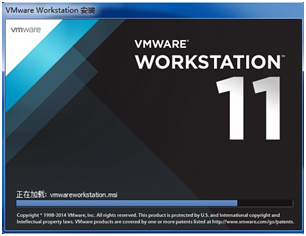

第1步:运行虚拟机软件

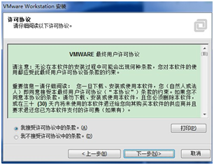

第2步:接受软件的许可

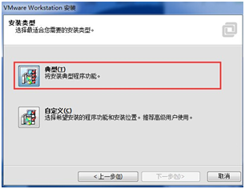

第3步:选择典型安装

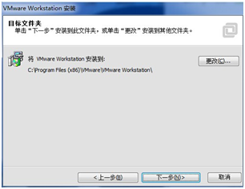

第4步:选择安装到的目录

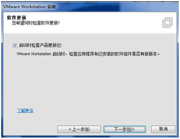

第5步:自动检查新版

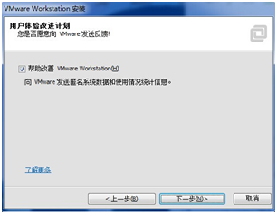

第6步:帮助改进虚拟机软件

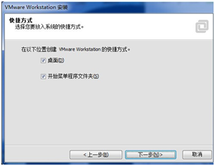

第7步:在桌面上创建图标（快捷方式）

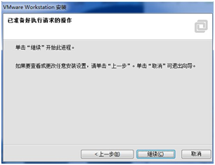

第8步:不错,一切都准备就绪了

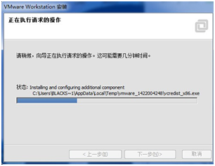

第9步:正常安装中

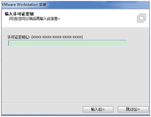

第10步:请填写密钥或直接跳过

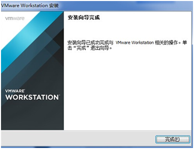

第11步:安装顺利完成,Good Job!

**模拟出用于安装RHEL7红帽操作系统的硬件配置。**

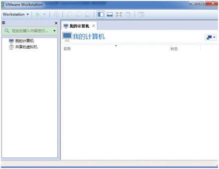

第1步：运行"Vmware WorkStation"，看到主页面

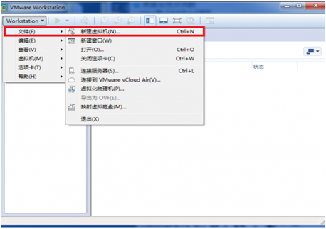

第2步：创建新的虚拟机

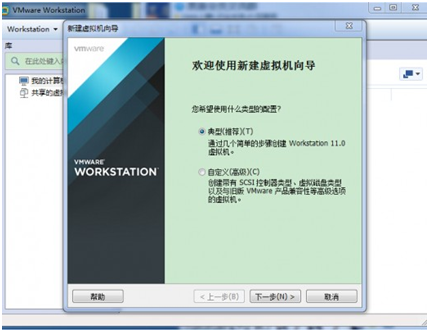

第3步：新建虚拟机向导——典型（推荐）

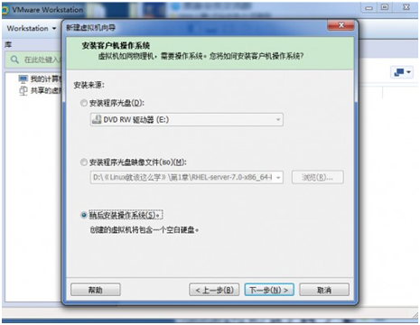

第4步：选择稍后安装操作系统

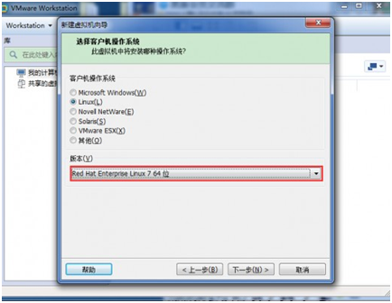

第5步：定义版本为"Red Hat Enterprise Linux 7 64位"

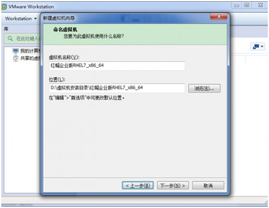

第6步：设置虚拟机名称与安装路径

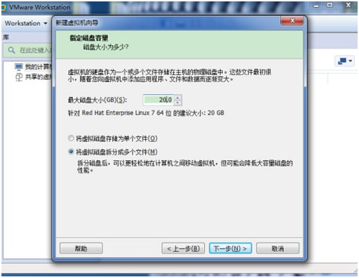

第7步：设置磁盘为20GB即可（足够了）

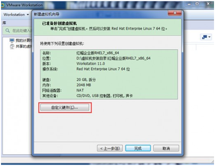

第8步：完成向导后请点击“自定义硬件”

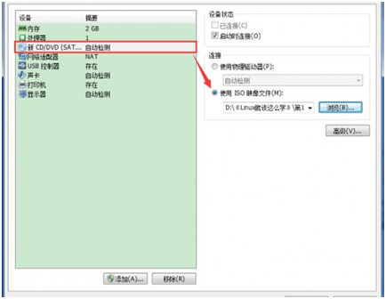

第9步：选择“设置光驱”，选择到RHEL7镜像

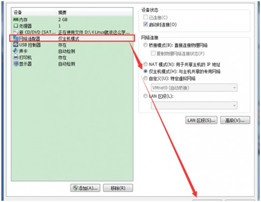

第10步：选择“设置网络适配器”为“仅主机模式”

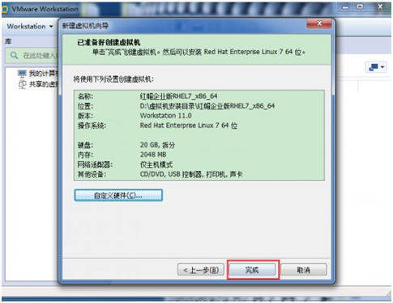

第11步：全部设置完成,请点击“完成”。

####1.3 VM安装RHEL7系统
通过上面小节已经将虚拟机配置完毕，现在正式安装红帽RHEL7系统啦。

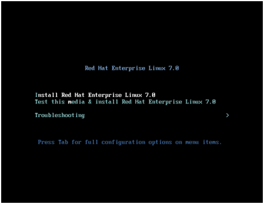

第1步:启动RHEL7的主机电源

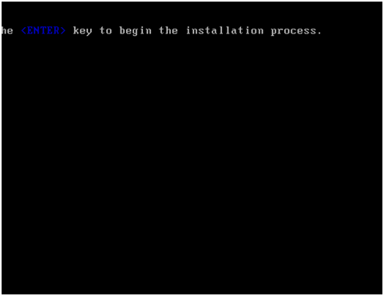

第2步:敲击回车

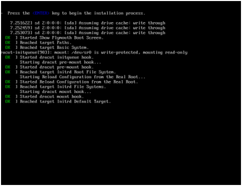

第3步:等待即可

第4步:选择安装系统时的语言

第5步:配置信息界面,敲击“Installation Destination”

第6步:进入后选择硬盘并点击左上角“Done”

第7步:返回主页面后再点击“Software Selection”后选择"Server With GUI"

第8步:返回主页面后再点击"Network & Hostname"后设置主机名"linuxprobe.com"

第9步:一切就绪后返回主页面并点击“Begin Installation”

第10步:点击“Root Password”

第11步:设置Root用户的密码（简单密码请双击Done）

第12步:等待安装完成后点击“Reboot”	

第13步:重启后选择“License Instormation”

第14步:选中“I accept the license agreement”后敲击“Done”

第15步:敲击“Finish Configuration”

第16步:为本书后章讲到的“Kdump”建议开启（默认）

第17步:选择“No.I prefer to register at later time.”

第18步:选择系统语言,（本书例题用英文版完成）

第19步:选择输入资源，默认即可

第20步:创建一个本地用户（权限比Root小，但更加安全）

第21步:设置系统时间（上海.中国）

第22步:选择“Start using Red Hat Enterprise Linux Server”

第23步:恭喜，您已经顺利的安装了红帽RHEL7操作系统

####1.4使用KVM安装系统
VmwareWorkstation可并不是唯一能够实现虚拟化的软件，如果您之前学习过Linux系统或有一定的命令行基础，并且想试试在linux系统中安装其他系统，现在就教给您操作方法，**新手读者请先跳过这个小节吧~**

**KVM**(**K**ernel **V**irtual **M**odule)能够提供像Vmware一样的全虚拟化功能——**让虚拟机用起来跟真实物理机一摸一样。**

**安装KVM之前我们要检查真实物理机是否支持虚拟化功能:**
<pre>[root@linuxprobe ~]# grep vmx /proc/cpuinfo
flags: fpu vme de pse tsc msr pae mce cx8 apic sep mtrr pge mca cmov pat pse36 clflush dts mmx fxsr sse sse2 ss syscall nx rdtscp lm constant_tsc arch_perfmon pebs bts nopl xtopology tsc_reliable nonstop_tsc aperfmperf pni pclmulqdq vmx ssse3 cx16 pcid sse4_1 sse4_2 x2apic popcnt aes xsave avx f16c rdrand hypervisor lahf_lm ida arat epb pln pts dtherm tpr_shadow vnmi ept vpid fsgsbase smep</pre>

如果执行该命令后没有输出vmx或svm值，但您的电脑是近几年买来的，那么很有可能只是在BIOS中默认关闭了，请去开启试试吧！
Inter处理器的虚拟技术标志为vmx。
AMD处理器的虚拟技术标志为svm。
安装KVM以及相关的依赖软件包：
[root@linuxprobe ~]# yum -y groupinstall "Virtualization Host"
[root@linuxprobe ~]# yum -y groupinstall "Virtualization Host"
Loaded plugins: langpacks, product-id, subscription-manager
………………省略部分安装过程………………
Complete! 
[root@linuxprobe ~]# yum -y install virt-{install,viewer,manager}
Loaded plugins: langpacks, product-id, subscription-manager
………………省略部分安装过程………………   
Complete!
为了让KVM中虚拟机能够互相共享数据，还必需配置真实机的网络：
让系统支持ipv4的转发功能：
[root@linuxprobe ~]# echo "net.ipv4.ip_forward = 1" > /etc/sysctl.d/99-ipforward.conf
让转发功能立即生效：
[root@linuxprobe ~]# sysctl -p /etc/sysctl.d/99-ipforward.conf
 net.ipv4.ip_forward = 1
新手读者们请注意，前方高能：
如果您还没有学习过Linux命令，Vim编辑器与网卡配置方法的话请先跳过本小节!!
将网卡配置文件中的IP地址、子网掩码等信息注释后追加参数BRIDGE=virbr0(设置网卡为桥接模式)：
[root@linuxprobe ~]# vim /etc/sysconfig/network-scripts/ifcfg-eno16777736
 DEVICE="eno16777736"
 ONBOOT=yes
 #IPADDR="192.168.10.10"
 #NETMASK="255.255.255.0"
 #GATEWAY="192.168.10.1"
 HWADDR="网卡的MAC地址"
 #DNS1="192.168.10.1"
 BRIDGE=virbr0
创建用于桥接网卡的配置文件（与上面的配置文件很相似）：
[root@linuxprobe ~]# vim /etc/sysconfig/network-scripts/ifcfg-virbr0
 DEVICE="virbr0"
 TYPE=BRIDGE
 ONBOOT=yes
 BOOTPROTO=static
 IPADDR="192.168.10.10"
 NETMASK="255.255.255.0"
 GATEWAY="192.168.10.1"
 DNS1="192.168.10.1"
当KVM安装完成并将网卡配置妥当后请重启(reboot)后再进行下面的检查操作：
检查kvm模块是否被加载以及能否正常的使用CPU虚拟化功能：
[root@linuxprobe ~]# lsmod | grep kvm
 kvm_intel 138567 0
 kvm 441119 1 kvm_intel
检查桥接的网卡配置是否启用成功：
[root@linuxprobe ~]# ip show virbr0
3: virbr0: <BROADCAST,MULTICAST,UP,LOWER_UP> mtu 1500 qdisc noqueue state UP
link/ether 00:0c:29:9c:63:73 brd ff:ff:ff:ff:ff:ff
inet 192.168.10.10/24 brd 192.168.10.255 scope global virbr0
valid_lft forever preferred_lft forever
inet6 fe80::20c:29ff:fe9c:6373/64 scope link
valid_lft forever preferred_lft forever
获取虚拟机列表（默认为空是正常的）：
[root@linuxprobe ~]# virsh -c qemu:///system list
Id Name State
----------------------------------------------------
太棒了！现在来配置虚拟机参数吧：
[root@linuxprobe ~]# virt-manager
第1步：填写虚拟机名称和设置安装模式。第2步：选中RHEL7镜像并设置系统类型。

第3步：设置内存量与CPU核数。  	第4步：定义硬盘容量。
第5步：检查配置后开启虚拟机。
 

1.5配置VNC服务程序
VNC虚拟网络计算机(Virtual Network Computing)是一款由欧洲实验室AT&T研发的远程控制程序，VNC服务程序可以运行在类Unix计算机系统之上，拥有强大的远程控制能力，高效且实用。
如果您是Linux初学者或不需要远程控制功能，请先翻过本小节，等学完Linux命令了再来学~
在红帽RHEL7系统中VNC的服务软件包叫做tigervnc-server：
[root@linuxprobe ~]# yum install tigervnc-server
Loaded plugins: langpacks, product-id, subscription-manager
………………省略部分安装过程………………
Installing:
tigervnc-server    x86_64    1.2.80-0.30.20130314svn5065.el7    rhel7    199 k
………………省略部分安装过程………………
Complete!
复制一份vnc服务程序的配置文件(文件名中的:3代表5903端口)：
[root@linuxprobe ~]# cp /lib/systemd/system/vncserver@.service /etc/systemd/system/vncserver@:3.service
编辑vnc服务的配置文件，将所有的修改为linuxprobe用户：
[root@linuxprobe ~]# vim /etc/systemd/system/vncserver@:3.service
[Unit]
Description=Remote desktop service (VNC)
After=syslog.target network.target
[Service]
Type=forking
# Clean any existing files in /tmp/.X11-unix environment
ExecStartPre=/bin/sh -c '/usr/bin/vncserver -kill %i > /dev/null 2>&1 || :'
ExecStart=/sbin/runuser -l  -c "/usr/bin/vncserver %i"
PIDFile=/home//.vnc/%H%i.pid
ExecStop=/bin/sh -c '/usr/bin/vncserver -kill %i > /dev/null 2>&1 || :'
[Install]
WantedBy=multi-user.target
配置防火墙规则：
[root@linuxprobe ~]# firewall-cmd --permanent --zone=public --add-port=5903/tcp
success
[root@linuxprobe ~]# firewall-cmd --reload
success
使用linuxprobe用户设置连接密码：
[linuxprobe@linuxprobe ~]$ vncserver 
You will require a password to access your desktops.
Password:此处输入连接密码
Verify:此处再次输入密码
New 'linuxprobe.com:1 (linuxprobe)' desktop is linuxprobe.com:1
Creating default startup script /linuxprobe/.vnc/xstartup
Starting applications specified in /linuxprobe/.vnc/xstartup
Log file is /linuxprobe/.vnc/linuxprobe.com:1.log
将vncserver服务程序启动并加入到开机启动项中：
[root@linuxprobe ~]# systemctl start vncserver@:3.service
[root@linuxprobe ~]# systemctl enable vncserver@:3.service
此时便可以使用vnc客户端工具连接啦

但是如果您出现了这样的报错：
xauth: (stdin):1:  bad display name "linuxprobe.com:1" in "add" command
代表您的主机名(hostname)不能被ping通，请执行这行命令：
echo "127.0.0.1 linuxprobe.com" > /etc/hosts

1.6 重置Root用户密码
平日里让管理员很头疼的事情太多了，偶尔把密码忘记了也不用慌，重置密码只需简单几步，一定要学会哦！红帽RHEL6系统与红帽RHEL7系统破解系统密码方法完整版:http://www.linuxprobe.com/reset-root-password/
如果您是刚刚接手了一台Linux系统，请先确认这台系统是不是红帽RHEL7系统再进行下面的操作哦：
[root@linuxprobe ~]# cat /etc/redhat-release 
Red Hat Enterprise Linux Server release 7.0 (Maipo)
第1步：开机后在内核上敲击“e”。
 
第2步：在linux16这行的后面输入“rd.break”并敲击“ctrl+x“。
 

第3步：进入到了系统的紧急求援模式。
 
第4步：依次输入以下命令。
mount -o remount,rw /sysroot
chroot /sysroot
echo "linuxprobe" | passwd --stdin root
touch /.autorelabel
exit
reboot
 
第5步：重启时会很慢，耐心等待即可。
 

1.7 安装虚拟机增加包
VMware Tools是VMware虚拟机中自带的增强工具包，用于增强虚拟机显卡与硬盘性能、同步虚拟机与主机的时钟时间、最主要的是可以支持虚拟机与主机之间的文件拖拽传输。
《Linux就该这么学》的第二章才会正式接触Linux命令，所以此刻您暂且无需对下面的安装过程完全理解。
第1步:在虚拟软件中选择“安装/重新安装VMware Tools(T)”：
 
第2步:安装VMwareTools功能增加包（请用root用户登陆系统）：
创建/media/cdrom目录:
[root@linuxprobe ~]# mkdir -p /media/cdrom
将光驱设备挂载到该目录上：
[root@linuxprobe ~]# mount /dev/cdrom /media/cdrom
进入到该挂载目录：
[root@linuxprobe ~]# cd /media/cdrom
将功能增强包复制到/home目录中：
[root@linuxprobe cdrom]# cp VMwareTools-9.9.0-2304977.tar.gz /home
进入到/home目录中：
[root@linuxprobe cdrom]# cd /home
解压功能增强包：
root@linuxprobe home]# tar xzvf VMwareTools-9.9.0-2304977.tar.gz
vmware-tools-distrib/
vmware-tools-distrib/FILES
vmware-tools-distrib/doc/
vmware-tools-distrib/doc/open_source_licenses.txt
vmware-tools-distrib/doc/INSTALL
vmware-tools-distrib/doc/README
vmware-tools-distrib/installer/
vmware-tools-distrib/installer/services.sh
vmware-tools-distrib/installer/guestproxy-ssl.conf
vmware-tools-distrib/installer/thinprint.sh
vmware-tools-distrib/installer/upstart-job.conf
………………此处省略解压过程细节………………
进入解压文件夹中：
[root@linuxprobe home]# cd vmware-tools-distrib/
运行安装脚本并加上参数-d，代表默认安装：
[root@linuxprobe vmware-tools-distrib]# ./vmware-install.pl -d
The installer has detected an existing installation of open-vm-tools on this
system and will not attempt to remove and replace these user-space
applications. It is recommended to use the open-vm-tools packages provided by
the operating system. If you do not want to use the existing installation of
open-vm-tools and attempt to install VMware Tools, you must uninstall the
open-vm-tools packages and re-run this installer.
The installer will next check if there are any missing kernel drivers. Type yes
if you want to do this, otherwise type no [yes]
………………省略部分安装过程………………
当您看到这个字样后，重启后即可正常使用VmwareTools啦。
Creating a new initrd boot image for the kernel.
Starting Virtual Printing daemon: done
Starting vmware-tools (via systemctl): [ OK ]
The configuration of VMware Tools 9.9.0 build-2304977 for Linux for this
running kernel completed successfully.
Enjoy,
--the VMware team
第3步：重新启动系统后生效：
[root@linuxprobe ~]# reboot 

1.8 重要的守护进程
当给一台主机安装上Linux系统后就可以工作了——包括接受用户的输入/计算/存储/再将结果输出等等，这是都是系统服务帮助我们完成的。而有一些系统服务需要时刻等待用户的输入（如键盘进程）或随时响应用户的请求（如网站服务进程）等等。
守护进程（Daemon）通常会随系统启动时激活并随系统关闭时停止，一直在系统后台中默默为用户提供服务：
守护进程名称	用处
crond	计划任务
dhcpd	动态IP地址分配服务（DHCP）
httpd	网站服务
lpd	打印服务器
named	域名解析服务（DNS）
nfs	文件共享服务（NFS)
smb	文件共享与打印服务（SAMBA）
syslog	系统日志
gpm	鼠标进程

1.9 红帽软件包管理器
在红帽软件包管理器（RPM）公布之前要想在Linux系统中安装软件只能采取“源码包”的方式安装，早期在Linux系统中安装程序是一件非常困难，耗费耐心的事情，因为大多数的服务程序仅仅提供编译源码，需要运维人员自行编译代码并解决许多的依赖关系，源码安装需要运维人员有很多的知识、高超的技能、甚至很好的耐心才能安装好一个程序，而且在安装、升级、卸载时还要考虑到其他程序、库的依赖关系，所以管理员在校验、安装、卸载、查询、升级等管理软件操作时难度非常大。
而RPM机制则为解决这些问题而设计的，RPM原称为“Redhat Package Manager”，因其卓越的优势很快被公众认可，目前使用范围也已不局限在红帽系统中了。RPM会建立统一的数据库文件，详细的记录软件信息并能够自动分析依赖关系，颇有一些“软件控制面板”的感觉。
安装软件:rpm -ivh filename.rpm
升级软件:rpm -Uvh filename.rpm
卸载软件:rpm -e filename.rpm
查询软件的描述信息:rpm -qpi filename.rpm
列出软件的文件信息:rpm -qpl filename.rpm
查询文件属于那个RPM:rpm -qf filename
虽然RPM能够帮助用户查询软件相关的依赖关系，但问题还是要自己解决，有些大型软件需要数十个依赖包也是不小的负担。
 

1.10 Yum软件仓库
Yum仓库则是为进一步简化RPM管理软件难度而设计的，Yum能够根据用户的要求分析出所需软件包及其相关依赖关系，自动从服务器下载软件包并安装到系统，听起来就已经很爽了吧？
 
yum软件仓库的使用拓扑图
用户能够根据需求来指定Yum仓库与是否校验软件包，而这些只需几条关键词即可完成，现在来学习下配置的方法.
所有Yum仓库的配置文件均需以.repo结尾并存放在/etc/yum.repos.d/目录中的。
[rhel-media]: yum源的名称，可自定义。
baseurl=file:///media/cdrom :提供方式包括FTP（ftp://..）、HTTP（http://..）、本地（file:///..）
enabled=1 : 设置此源是否可用，1为可用，0为禁用。
gpgcheck=1 : 设置此源是否校验文件，1为校验，0为不校验。
gpgkey=file:///media/cdrom/RPM-GPG-KEY-redhat-release :若为校验请指定公钥文件地址。
Yum仓库中的RPM软件包可以是由红帽官方发布的，也可以是第三方组织发布的，当然用户也可以编写的~
本书提供的镜像光盘内已经包含了大量的可用RPM软件包，将会在后面的实验章节中为大家演示如何使用。
命令	作用
yum repolist all	列出所有仓库。
yum list all	列出仓库中所有软件包
yum info 软件包名称	查看软件包信息
yum install 软件包名称	安装软件包
yum reinstall 软件包名称	重新安装软件包
yum update 软件包名称	升级软件包
yum remove 软件包	移除软件包
yum clean alla	清除所有仓库缓存
yum check-update	检查可更新的软件包
yum grouplist	查看系统中已经安装的软件包组
yum groupinstall 软件包组	安装指定的软件包组
yum groupremove软件包组	移除指定的软件包组
yum groupinfo 软件包组	查询指定的软件包组信息
